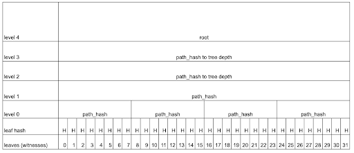
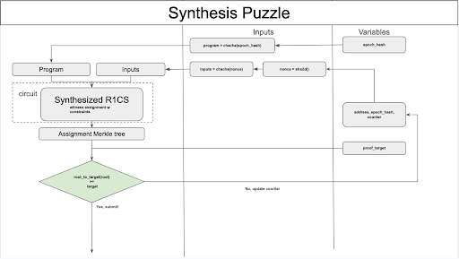
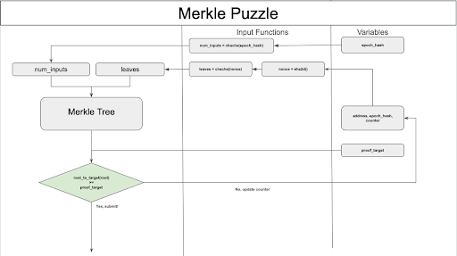

# Aleo Mainnet Puzzle

[Introduction](#introduction)

[Goals](#goals)

[Design](#design)

[Security Analysis](#security-analysis)

[Implementation](#implementation)

[Testing](#testing)

[Benchmarks](#benchmarks)

[Governance](#governance)

# Introduction

The Aleo blockchain introduces a computational puzzle aimed at
incentivizing the acceleration of zkSNARKs and Aleo-specific program
optimizations. Historically, puzzles on Aleo's test networks targeted
the generation of entire proofs or focused on optimizing computationally
intensive aspects of proof generation, such as Multi-Scalar
Multiplications (MSM) and Number Theoretic Transforms (NTT). However,
advancements in these areas have reduced their dominance in proof
generation time, prompting a new focus for the next iteration.

The puzzle sets its sights on enhancing synthesis, otherwise known as
witness generation. This area is particularly crucial for Aleo, as it
represents a significant portion of the time spent in generating proof
for Aleo programs. By directing efforts towards synthesis, the puzzle
aims to address a critical bottleneck specific to Aleo's ecosystem,
ensuring a more streamlined and efficient process for developers and
users alike. This strategic emphasis not only caters to the unique needs
of Aleo's platform but also fosters innovation and optimizations in the
broader ecosystem.

# Goals

The puzzle has been designed with the following goals in mind.

-   **Hardness:** Ensure that no adversary can compute solutions to the
    puzzle faster than through random guessing. This requires the system
    to be memoryless, or non-amortizable, meaning that the probability
    of winning does not depend on the time spent computing a solution.


-   **System Safety:** The design and its implementation must prevent
    attacker-controlled inputs from causing denial of service (DoS)
    attacks, crashes, code execution, or any other unexpected changes to
    the system.


-   **Uniquely-Determined Circuits:** Maintain the soundness and
    uniqueness of opcode circuits in zero-knowledge proofs, preventing
    the existence of multiple valid assignments that could allow for
    cheaper puzzle attempts.


-   **Consistency in Resource Consumption:** Distribute the puzzle
    running time and resource consumption to minimize variance and the
    risk of extreme behaviors, aiming for a distribution that is more
    Gaussian-like than power-law-like.


-   **Maximizing Usefulness:** The majority of the computation should
    focus on "useful" algorithms.

# Design

## Overview

We provide a high-level description of the puzzle's use in the protocol
below .

1.  Provers construct puzzle solutions and broadcast them to the
    network.


2.  Validators aggregate solutions and transactions into a set for the
    next block via the consensus mechanism.

    -   The set of solutions cannot exceed the `MAX_SOLUTIONS` allowed
        in a block.

    -   Validators are not required to verify solutions beforehand.


3.  During block production, validators will process solutions in order,
    accepting up to `MAX_SOLUTIONS` valid solutions and aborting the
    rest. The ledger state is updated accordingly.

    -   The validator maintains a ledger which stores the:
        - `latest_epoch_hash`: The latest epoch hash.

        - `latest_proof_target`: The minimum target a solution must
              reach to be accepted.

        - `cumulative_proof_target`: The aggregated sum of proof
               targets for valid solutions, from the previous block.

        - `coinbase_target`: The expected sum of proof targets,
              which acts as a threshold for difficulty adjustment.

    -   A solution is valid if its:

        -  `epoch_hash` matches the ledger's `latest_epoch_hash`

        - `proof_target`, computed for each solution, meets the
            `latest_proof_target`.

        - Fewer than `MAX_SOLUTIONS` solutions have already been
             accepted for this block.

    -   A valid solution is rewarded proportionally to its share of the
        sum of the `proof_target`s for the set of accepted solutions.

    -   Each `proof_target` is added to `cumulative_proof_target`.

    -   If the updated `cumulative_proof_target` exceeds the
        `coinbase_target`, the next `coinbase_target` and next
        `latest_proof_target` is updated according to a defined
        retargeting algorithm.

    -   If the block height reaches the next epoch, the
        `latest_epoch_hash` is updated.

The puzzle itself has two instantiations: the **Synthesis Puzzle** and
the **Merkle Puzzle**. The latter is smaller and used for testing
purposes. The two share common components and provide the same interface
to submit solutions. The two differ in the computational component
emphasized in the puzzle. The Merkle puzzle is intended to function as a
de-featured version of the synthesis puzzle.

## Common Components

### Inputs

Both versions of the puzzle take the same set of inputs:

-   `address: Address<N>**` The address that is rewarded, if the
    puzzle solution is valid for the current proof target.

-   `epoch_hash: N::Blockhash` The current epoch block hash. A valid
    solution for the current epoch must use the current epoch hash. If
    any other epoch hash is used, the puzzle solution should **always**
    be invalid.

-   `counter: u64` A counter that is varied across multiple attempts
    of the puzzle for a given address and epoch hash.

This 3-tuple of `(address, epoch_hash, counter)` defines a unique
attempt at a puzzle solution. This set of inputs is used to form a
per-attempt `nonce`, which is then used to seed an RNG to
deterministically generate unique, random internal values for a given
puzzle attempt. The internal values differ between the Synthesis Puzzle
and Merkle Puzzle.

### K-ary Merkle Tree

-   Both versions of the puzzle use a K-ary Merkle Tree of `DEPTH` 8
    and `ARITY` 8.

-   The leaf and path hash functions is SHA-256.

-   A diagram of a K-ary Merkle Tree of `DEPTH` 5 and `ARITY
    8 is given below.



-   Both versions of the puzzle produce a Merkle root, which is
    converted into a solution `proof_target`. The target is compared
    against the `latest_proof_target` which determines whether or not
    the solution is valid.

## Synthesis Puzzle

The synthesis puzzle emphasizes synthesizing a valid R1CS assignment as
the key computational element of the puzzle.

The steps for constructing a solution for synthesis puzzle are given
below:

1.  Construct an attempt-specific `nonce` from the `address`,
    `epoch_hash`, and `counter`.

2.  Sample an `EpochProgram` using the `epoch_hash`.

3.  Sample an attempt-specific set of inputs using an RNG seeded by the
    `nonce`.

4.  Synthesize the R1CS for the `EpochProgram` and puzzle inputs.

5.  Convert the R1CS assignment into a sequence of Merkle leaves.

6.  Compute the Merkle root and convert it into a `proof_target`.

7.  If the `latest_proof_target` meets the `proof_target`, submit
    the `address`, `epoch_hash`, and `counter` as a solution.
    Otherwise, repeat the steps above.

### Sampling Programs 

Each epoch, an `EpochProgram` is sampled using the `epoch_hash`. The
`epoch_hash` is used to seed an RNG, which selects a sequence of
abstract instructions according to some fixed distribution. The abstract
instructions are then concretized into a valid program using the
`Register Table` to correctly track the active set of registers.

Instructions are sampled from a defined instruction set by weight. The
weight is set according to the output entropy.

Each entry in the instruction set is a vector of at most
`NUM_SEQUENCE_INSTRUCTIONS` is returned, each consisting of a tuple
with:

-   The instruction as [defined here](https://developer.aleo.org/aleo/opcodes).

-   The operands, which can be:

    -   `Ephemeral`

    -   `Input`

    -   `Literal`

    -   `Register`

    -   `RegisterOffset`

-   The destinations.

    -   `Ephemeral`

    -   `Register`

#### Destinations
Ephemeral destinations are locally available registers that are not
added to the register table. They can be used later in the sequence, but
are not available afterwards.

Register destinations are registers stored in the register table.

#### Operands
Register operands indicate that the register to be used must be the most
recent element in the register table.

Ephemeral operands are registers locally available to the sequence. They
must be an ephemeral destination from a previous instruction in the
sequence.

Input operands reference the original inputs to the program.

Literal operands specify constants to be used as operands.

Register offsets indicate that the register to be used must be from the
`RegisterTable`, offset by an index. That is, the 0-th index is the
most recent element in the register table, the 1-st index is the second
most recent and so on.

#### An Example

Below is an example of a defined sequence of instructions in the
instruction set.

```rust
(vec![
    (Instruction::IsEq,
    vec![
        Operand::Register(LiteralType::Field),
        Operand::Literal(Literal::Field(Field::zero()))],
    vec![
        Destination::Ephemeral(LiteralType::Boolean, 0)
    ]),
    (Instruction::Ternary,
    vec![
        Operand::Ephemeral(LiteralType::Boolean, 0),
        Operand::Input(LiteralType::Field, 0),
        Operand::Register(LiteralType::Field)],
    vec![
        Destination::Ephemeral(LiteralType::Field, 1)]),
    (Instruction::Div,
    vec![
        Operand::RegisterOffset(LiteralType::Field, 1),
        Operand::Ephemeral(LiteralType::Field, 1)],
    vec![Destination::Register(LiteralType::Field)])],
VERY_LOW)
```

This sequence,

1.  Loads the most recent `Field` register, checks if it is equal to
    zero, stores the result into a new destination register, and stores
    the register as the 0-th ephemeral register.

2.  Checks if the value in the 0-th ephemeral register is `true`. If
    so, loads the 0-th input `Field` register. Otherwise, loads the
    most recent `Field` register from the register table. Stores the
    result into a new destination register, and stores the register as
    the 1-st ephemeral register.

3.  Loads the 2-nd most recent `Field` register from the register
    table, divides it by the 1-st ephemeral register, stores the result
    into a new destination register, and stores the register as the most
    recent `Field` register in the register table.

### Register Table

The register table initializes and stores active registers while
constructing the epoch program.
The table contains a 2-deep stack of registers for each `LiteralType`.
The table is initialized according to the preamble below.

**Preamble**

```aleo
input r0 as boolean.public;
input r1 as boolean.public;
input r2 as i8.public;
input r3 as i8.public;
input r4 as i16.public;
input r5 as i16.public;
input r6 as i32.public;
input r7 as i32.public;
input r8 as i64.public;
input r9 as i64.public;
input r10 as i128.public;
input r11 as i128.public;
input r12 as field.public;
input r13 as field.public;

is.eq r1 r0 into r14;
is.eq r3 r2 into r15;
is.eq r5 r4 into r16;
is.eq r7 r6 into r17;
is.eq r9 r8 into r18;
is.eq r11 r10 into r19;

hash.psd2 r12 into r20 as u8;
hash.psd2 r13 into r21 as u8;
hash.psd2 r12 into r22 as u16;
hash.psd2 r13 into r23 as u16;
hash.psd2 r12 into r24 as u32;
hash.psd2 r13 into r25 as u32;
hash.psd2 r12 into r26 as u64;
hash.psd2 r13 into r27 as u64;
hash.psd2 r12 into r28 as u128;
hash.psd2 r13 into r29 as u128;

mul.w r3 r2 into r30;
mul.w r5 r4 into r31;
mul.w r7 r6 into r32;
mul.w r9 r8 into r33;
mul.w r11 r10 into r34;

ternary r15 r30 r2 into r35;
ternary r16 r31 r4 into r36;
ternary r17 r32 r6 into r37;
ternary r18 r33 r8 into r38;
ternary r19 r34 r10 into r39;
```

#### Instruction Variants

Below are the all instruction variants in the puzzle and whether or not
they are sampled.

-   `Abs`: No
-   `AbsWrapped`: Yes
-   `Add`: Yes
-   `AddWrapped`: Yes
-   `And`: Yes
-   `AssertEq`: No
-   `AssertNeq`: No
-   `BranchEq`: No
-   `BranchNeq`: No
-   `Cast`: No
-   `CastLossy`: Yes
-   `CommitBhp256`: No
-   `CommitBhp512`: No
-   `CommitBhp768`: No
-   `CommitBhp1024`: No
-   `CommitPed64`: No
-   `CommitPed128`: No
-   `Div`: Yes
-   `DivWrapped`: Yes
-   `Double`: No
-   `Gt`: Yes
-   `Gte`: Yes
-   `HashBhp256`: Yes
-   `HashBhp512`: No
-   `HashBhp768`: No
-   `HashBhp1024`: No
-   `HashKeccak256`: No
-   `HashKeccak384`: No
-   `HashKeccak512`: No
-   `HashPed64`: Yes
-   `HashPed128`: No
-   `HashPsd2`: No
-   `HashPsd4`: No
-   `HashPsd8`: No
-   `HashSha3256`: No
-   `HashSha3384`: No
-   `HashSha3512`: No
-   `Inv`: Yes
-   `IsEq`: Yes
-   `IsNeq`: Yes
-   `Lt`: Yes
-   `Lte`: Yes
-   `Mod`: Yes
-   `Mul`: Yes
-   `MulWrapped`: Yes
-   `Nand`: Yes
-   `Neg`: Yes
-   `Nor`: Yes
-   `Not`: Yes
-   `Or`: Yes
-   `Pow`: Yes
-   `PowWrapped`: Yes
-   `Rem`: No
-   `RemWrapped`: Yes
-   `Shl`: No
-   `ShlWrapped`: Yes
-   `Shr`: No
-   `ShrWrapped`: Yes
-   `Sqrt`: No
-   `Square`: Yes
-   `Sub`: No
-   `SubWrapped`: Yes
-   `Ternary`: Yes
-   `Xor`: Yes

### Diagram



### Pseudocode

```
#############################################################################
# Inputs
#############################################################################

# The address to be rewarded
Address address

# The block hash of the latest epoch
N::Blockhash epoch_hash

# The counter
u64 counter

# The target difficulty
u64 puzzle_target

#############################################################################
# Sample the epoch program, once per epoch
#############################################################################

EpochProgram program = EpochProgram::new(epoch_hash)

#############################################################################
# Construct a valid solution
#############################################################################

counter = 0
while (1)
    # Generate nonce for the RNG
    # Note, this nonce should be unique to **all** attempts
    u64 nonce = sha2(sha2(address, epoch_hash, counter)).to_u64()
    
    # Seed the RNG using nonce
    rng = chacha(nonce)
    
    # Construct the inputs to the program
    Vec<Value> inputs = program.construct_inputs(rng)
    
    # Construct the leaves of the Merkle Tree
    Vec<Vec<bool>> leaves = program.to_leaves(inputs);
    
    # Generate the root of a SHA3-256 Merkle Tree with arity 8 over the leaves
    u256 root = merkle_tree(leaves)
    
    # Get the lower 64 bits of the root
    u64 root_as_u64 = root.to_u64()
    
    # Compute the target
    u64 target = if root_as_u64 == 0u64 {
        u64::MAX
    } else {
        u64::MAX / root_as_u64
    }
    
    # If the candidate does not meet the target, try again
    if target < puzzle_target
        counter++
        next
    
    return (counter, root)
```

## Merkle Puzzle

The merkle puzzle emphasizes computing the root of a Merkle tree as the
key computational element of the puzzle.

The steps for constructing a solution for the Merkle puzzle are given
below:

1.  Construct an attempt-specific `nonce` from the `address`,
    `epoch_hash`, and `counter`.

2.  Sample the number of Merkle leaves using the `epoch_hash`.

3.  Sample the Merkle leaves using an RNG, seeded by the `nonce`.

4.  Compute the Merkle root and convert it into a `target`.

5.  If the `target` meets the `proof_target`, submit the
    `address`, `epoch_hash`, and `counter` as a solution.
    Otherwise, repeat the steps above.

### Diagram



### Pseudocode 

```
#############################################################################
# Inputs
#############################################################################

# The address to be rewarded
Address address

# The block hash of the latest epoch
N::Blockhash epoch_hash

# The counter
u64 counter

# The target difficulty
u64 puzzle_target

#############################################################################
# Sample the number of leaves in the Merkle Tree, once per epoch
#############################################################################

# Seed the RNG using the lower 64 bits of the epoch hash
u64 epoch_hash_as_u64 = epoch_hash.to_u64()
epoch_rng = chacha(epoch_hash_to_u64)

# Sample the number of leaves
u32 num_leaves = epoch_rng.sample_range(100000, 200000)

#############################################################################
# Construct a valid solution
#############################################################################

counter = 0
while (1)
    # Generate nonce for the RNG
    # Note, this nonce should be unique to **all** attempts
    u64 nonce = sha2(sha2(addr, epoch_hash, counter)).to_u64()
    
    # Seed the RNG using nonce
    rng = chacha(nonce)
    
    # Construct the leaves of the Merkle Tree
    Vec<Vec<bool>> leaves = rng.sample_leaves(num_leaves)
    
    # Generate the root of a SHA3-256 Merkle Tree with arity 8 over the leaves
    u256 root = merkle_tree(leaves)
    
    # Get the lower 64 bits of the root
    u64 root_as_u64 = root.to_u64()
    
    # Compute the target
    u64 target = if root_as_u64 == 0u64 {
        u64::MAX
    } else {
        u64::MAX / root_as_u64
    }
    
    # If the candidate does not meet the target, try again
    if target < puzzle_target
        counter++
        next
    
    return (counter, root)
```

# Security Analysis

## Hardness

Precomputation of instructions into a lookup table is generally not an
effective strategy given that the size of a lookup table grows
exponentially in the number of inputs and outputs of the operation.
However, it might be possible when there are many chained operations
operating over a small input space, and when solutions can be submitted
for a particular program for a long enough time. We did not identify
instructions at risk of precomputation.

In order for the solution to the entire puzzle to not be predictable, we
need the value of intermediate registers to also not be predictable. If
they were, it could enable precomputation, but also more parallelization
than intended, by allowing synthesis to be initiated from multiple
points in the circuit concurrently. The risk of parallelization is
reduced if:

1. There are very few operations with low output entropy. This is the
case in Aleo's PoW, because instructions with low output entropy have
been given a low sampling weight. Note that we can distinguish two ways
in which the predictability of intermediate registers can be measured:

-   If *individual* operators and operands have low output entropy. For
    example, the output entropy of **is.eq** over randomly sampled u8
    inputs is **0.037**
    $= \  - 1\ *\ \frac{2^{8}}{2^{16}}\log\frac{2^{8}}{2^{16}} + \frac{2^{16} - {\ 2}^{8}}{2^{16}}\log\frac{2^{16} - {\ 2}^{8}}{2^{16}}$.

-   If *combinations* of operators and operands have low output entropy.
    For example, the outputs of f(X, Y, Z) = { **sub** (**add** X Y) Z }
    where (X, Y, Z) are randomly sampled u8 inputs has a gaussian
    distribution with [standard
    deviation](https://en.wikipedia.org/wiki/Standard_deviation#Identities_and_mathematical_properties)
    of ~128 and resulting [output
    entropy](https://en.wikipedia.org/wiki/Entropy_(information_theory)#Entropy_for_continuous_random_variables)
    of 6.27 bits. Different distributions and lower standard deviations
    result in lower output entropy.

2. Sampled programs are structured in such a way that they periodically
operate on values from older registers. This is the case in Aleo's PoW,
because various operations access much earlier registers using
`RegisterOffset`.

## The easy program problem

RandomX suffers from the [easy program problem](https://github.com/tevador/RandomX/blob/master/doc/design.md#12-the-easy-program-problem),
whereby an attacker with hardware optimized for a subset of operations
might keep sampling programs, thereby landing on programs for which it
has an unfair advantage. They resolve this by [chaining multiple programs together](https://github.com/tevador/RandomX/blob/master/doc/design.md#a-the-effect-of-chaining-vm-executions),
whereby the output of the previous program determines the input for the
next. This ensures miners which want to have a high chance of success
need to support the full instruction and operand set.

In contrast to RandomX, Aleo's PoW programs are fixed per epoch. Still,
it is possible for a program to mostly contain a subset of operations,
and for a miner to be specialized in that subset of operations. The
solution for this is to ensure operations (with high output entropy) are
equally sampled and empirically validate that a significant enough
portion of programs contains the desired range of operations.

# Implementation

## Key Components

### Puzzle Trait

-   `PuzzleTrait` defines the interface for all puzzles.

-   Both **Synthesis Puzzle** and **Merkle Puzzle** satisfy this
    interface.

### Puzzle

-   An instance of the puzzle, either the **Synthesis Puzzle** or
    **Merkle Puzzle.**

### Solution

-   A puzzle solution.

-   Constructed from an **address**, **epoch_hash**, and **counter.**

### SolutionID

-   A unique identifier for a puzzle solution.

-   The `SolutionID` must be unique for all solutions submitted to the
    network.

-   The protocol checks for uniqueness and rejects solutions whose
    solution IDs have already been recorded by the ledger.

### PuzzleSolutions

-   An aggregate of valid puzzle solutions.

## Constants

### GENESIS_COINBASE_TARGET

-   The coinbase target for the genesis block. This should be
    `MAX_SOLUTIONS * GENESIS_PROOF_TARGET`. This is the minimum
    allowed coinbase target.

### GENESIS_PROOF_TARGET

-   The proof target for the genesis block. This is the minimum allowed
    proof target.

### MAX_SOLUTIONS

-   The maximum number of valid solutions in a block. A block may be
    constructed with a greater number of valid solutions, but only
    `MAX_SOLUTIONS` should be accepted. The rest, regardless of
    validity should be aborted.

# Testing

### `merkle::test_num_leaves`

-   Checks that the sampled number of leaves for a given epoch is within
    the expected range.

### `merkle::test_to_leaves`

-   Checks that the number of leaves generated by
    `MerklePuzzle::to_leaves` generates the correct number of leaves.

### `merkle::test_to_all_leaves`

-   Check that the number of leaves generated for each epoch hash by
    `MerklePuzzle::to_all_leaves` is correct and matches the leaves
    generated by `MerklePuzzle::to_leaves`.

### `instruction_set::check_weights_are_valid`

-   Check that the sum of the weights of the sampled instructions do not
    exceed `u16::MAX`.

### `instruction_set::check_ephemeral_registers_are_valid`

-   Check that each instruction sequence in `instruction_set`:

    -   uses sequentially increasing ephemeral registers as
        destinations.

    -   uses valid ephemeral registers as operands.

### `instruction_set::check_register_offsets_are_valid`

-   Check that `PuzzleOperand::RegisterOffset`s do not look back by
    more than 1 register.

-   This is necessary to ensure that the generated instructions use
    `RegisterTable` properly.

### `instruction_set::check_that_instructions_are_valid`

-   Check that each instruction sequence does not exceed
    `NUM_SEQUENCE_INSTRUCTIONS`

-   Check that no instruction is a `BranchEq` or `BranchNeq`.

### `instruction_type::test_puzzle_instruction_type`

-   Check that `PuzzleInstructionType` is correctly initialized based
    on its numerical variant.

### `instruction_type::test_puzzle_instruction_type_all`

-   Check that `NUM_PUZZLE_INSTRUCTION_VARIANTS` matches the number of
    `PuzzleInstructionType`s.

-   Check that each instruction type matches its expected numerical
    variant.

### `instruction_type::test_puzzle_instruction_type_opcode`

-   Check that each `PuzzleInstructionType` variant has a defined
    opcode.

### `instruction_type::test_puzzle_instruction_type_num_literals`

-   Check that the number of operands for each `PuzzleInstructionType`
    variant is within the expected range.

### `synthesis::helpers::test_sample_instructions`

-   Checks that the number of instructions sampled for a given epoch is
    within the expected range.

### `synthesis::helpers::test_sample_program`

-   Checks that the epoch program sampled for a given epoch is
    well-formed:

    -   The program is syntactically valid.

    -   The number of inputs is correct.

    -   The number of instructions is within the expected range.

### `synthesis::helpers::test_sample_instructions_is_deterministic`

-   Checks that the sets of instructions sampled for the same epoch
    match.

### `synthesis::helpers::register_table::test_register_table`

-   Check that the register table:

    -   contains the correct number of entries.

    -   contains the correct `LiteralType`s.

    -   contains the correct number of registers per `LiteralType`.

    -   initializes to the correct `next_register_locator`.

### `synthesis::helpers::register_table::test_get_k_th_last_register`

-   Checks that for each `LiteralType` in the `RegisterTable` that
    getting the k-th last register retrieves the expected register.

### `synthesis::helpers::register_table::test_input_block_is_well_formed`

-   Check that a `Program` formed from `RegisterTable::input_block`
    forms a valid program with the `NUM_INPUTS` inputs and
    `NUM_PREAMBLE_INSTRUCTIONS` instructions.

### `synthesis::test_get_epoch_program`

-   Check that the sampled `EpochProgram` matches given the same epoch
    hash.

### `synthesis::test_to_leaves`

-   Checks that the sampled inputs for the sampled `EpochProgram`
    matches given the same epoch hash and RNG seed.

### `synthesis::test_to_all_leaves`

-   Check that the number of leaves generated for each epoch hash and
    seed by `SynthesisPuzzle::to_all_leaves` is correct and matches
    those generated by `SynthesisPuzzle::to_leaves`.

### `synthesis::program::test_new_is_deterministic`

-   Checks that the programs sampled for the same epoch match

### `synthesis::program_test_instructions_succeeds`

-   Checks that the instructions can be correctly retrieved from an
    `EpochProgram`

### `synthesis::program::to_leaves::test_next_power_of_n`

-   Check that the next power of `n` greater than `base` is correct.

### `synthesis::program::test_next_power_of_n_edge_cases`

-   Check that the next power of `n` for `n` equal to `0` or `1`
    returns `None`.

### `synthesis::program::test_next_power_of_n_overflow`

-   Check that the next power of `n` returns `None` on overflow.

### `puzzle::test_puzzle`

-   For various numbers of solutions:

    -   check that `Puzzle::prove` correctly generates a solution.

    -   check that `Puzzle::check_solutions` succeeds for the correct
        epoch hash and target.

    -   check that `Puzzle::check_solutions` fails for the incorrect
        epoch hash.

### `puzzle::test_prove_with_minimum_proof_target`

-   Checks that `Puzzle::prove` produces a invalid solution for a
    proof target greater than the solution's proof target.

-   Checks that `Puzzle::prove` produces a valid solution for a proof
    target equal to the solution's proof target.

### `puzzle::test_prove_with_no_minimum_proof_target`

-   Checks that `Puzzle::prove` produces a valid solution, if the
    proof target is 0.

### `puzzle::test_check_solutions_with_duplicate_nonces`

-   Check that a `PuzzleSolutions` object cannot be instantiated with
    duplicate solutions.

### `puzzle::test_get_proof_targets_without_cache`

-   Check that the proof target is correctly computed without caching in
    the `Puzzle` object.

### `puzzle::test_get_proof_targets_with_partial_cache`

-   Check that the proof target is correctly computed with caching in
    the `Puzzle` object.

### `puzzle::solutions::test_new_is_not_empty`

-   Check that `PuzzleSolutions` cannot be initialized without a
    solution.

### `puzzle::solutions::test_len`

-   Check that `PuzzleSolutions::len` returns the correct number of
    solutions.

### `puzzle::solutions::test_is_empty`

-   Check that `PuzzleSolutions`, initialized with solutions, is not
    empty.

### `puzzle::solutions::test_solution_ids`

-   Check that `PuzzleSolutions::solution_ids` returns the correct
    number of solutions.

### `puzzle::solutions::test_get_solution`

-   Check that `PuzzleSolutions::get_solution` returns the correct
    solution.

### `puzzle::solutions::test_to_accumulator_point`

-   Check that `PuzzleSolutions::to_accumulator_point` returns the
    expected value.

### `ledger::test_duplicate_solutions_ids`

-   Constructs a valid solution, meeting the proof target.

-   Attempts to create a block with two instances of the valid solution
    and checks that block production fails.

-   Attempts to create a block with one instance of the valid solution
    and checks that block production succeeds.

### `ledger::test_excess_invalid_solution_ids`

-   Samples `MAX_SOLUTIONS` valid solutions, each meeting the required
    proof target.

-   Samples `MAX_SOLUTIONS` invalid solutions, each failing to meet
    the required proof target.

-   Shuffles the valid and invalid solutions together.

-   Checks that the valid solutions are all accepted, while the invalid
    solutions are rejected.

### `ledger::test_excess_valid_solution_ids`

-   Samples `2 * MAX_SOLUTIONS` valid solutions, each meeting the
    required proof target.

-   Checks that the first `MAX_SOLUTIONS` solutions are accepted,
    while the rest are aborted.

### `vm::test_vm_puzzle`

-   Checks that the VM correctly downcasts the puzzle instance and uses
    the underlying traits to generate a valid solution.

# Benchmarks 

The benchmarks were run on a 2021 Apple M1 Max with 32 GB RAM.

## Synthesis Puzzle

### `Puzzle::prove`

| \# of Instructions | Runtime (ms) |
| ------------------ | ------------ |
| 10                 | 68.87 |
| 100                | 119.5 |
| 1000               | 423.6 |
 
### `Puzzle::get_all_leaves`
| \# of Solutions        | \# of Instructions | Runtime (ms) |
| ---------------------- | ------------------ | ------------ |
| 1                      | 10 | 58.58 |
| 1                      | 100 | 85.80 |
| 1                      | 1000 | 359.2 |
| 2                      | 100 | 96.42 |
| 4                      | 100 | 99.292 |

### `Puzzle::check_solutions`
| \# of Solutions         | \# of Instructions | Runtime (ms) |
| -----------------------  | ------------------ | ------------ |
| 1                       | 10 | 69.08 |
| 1                       | 100 | 120.7 |
| 1                       | 1000 | 433.1 |
| 2                       | 100 | 142.5 |
| 4                       | 100 | 183.7 |

Note that the number of leaves produced by an instance of the Synthesis
Puzzle is dependent on the program constructed from the sampled epoch
hash. Each benchmark iteration samples a new epoch program and each
benchmark run performs 50 iterations.

##  Merkle Puzzle 

### `Puzzle::prove`
| \# of Leaves  | Runtime (ms) |
| ------------- | ------------ |
| 10            | 0.048 |
| 100           | 0.285 |
| 1000          | 1.142 |
| 10000         | 9.989 |
| 100000        | 96.52 |
| 1000000       | 942.7 |
 
### `Puzzle::get_all_leaves`
| \# of Solutions        | \# of Leaves | Runtime (ms) |
| ---------------------- | ------------ | ------------ |
| 1                      | 1000 | 0.461 |
| 1                      | 10000 | 4.594 |
| 1                      | 100000 | 54.74 |
| 1                      | 1000000 | 581.4 |
| 2                      | 100000 | 62.44 |
| 4                      | 100000 | 59.76 |

## `Puzzle::check_solutions`
| \# of Solutions         | \# of Leaves | Runtime (ms) |
| -----------------------  | ------------ | ------------ |
| 1                       | 1000 | 1.412 |
| 1                       | 10000 | 9.993 |
| 1                       | 100000 | 99.47 |
| 1                       | 1000000 | 920.2 |
| 2                       | 100000 | 126.7 |
| 4                       | 100000 | 200.99 |

# Governance

The governance of the puzzle will be handled by the Aleo Network
Foundation, through the defined protocol upgrade process.
